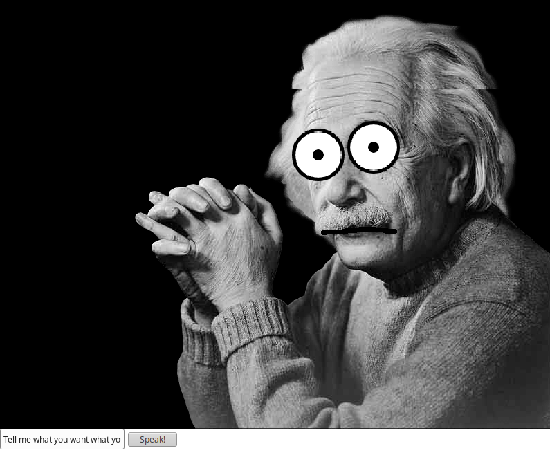

# Make a character talk

> A small experiment to show how to make a 2D Character talk using only web technology (HTML5 Canvas + WebGL + WebSpeech) and with the help of pixi.js.



## How to run

Just run the following commands:

```
yarn
make start
```

Then a browser should open, showing the app.

## Further resources

* Pixi.js Website: http://www.pixijs.com/
* Excellent Pixi.js Tutorial: https://github.com/kittykatattack/learningPixi
* Official TypeScript documentation: https://www.typescriptlang.org/docs/home.html
* Webpack TypeScript guide: https://webpack.js.org/guides/typescript/
* Highly recommended GitBook on TypeScript: https://basarat.gitbooks.io/typescript/docs/getting-started.html (This one's always loads a little slow, but it is an excellent read)
* Basics on Speech Synthesis with WebSpeech API: https://developer.mozilla.org/en-US/docs/Web/API/Web_Speech_API/Using_the_Web_Speech_API#Speech_synthesis

