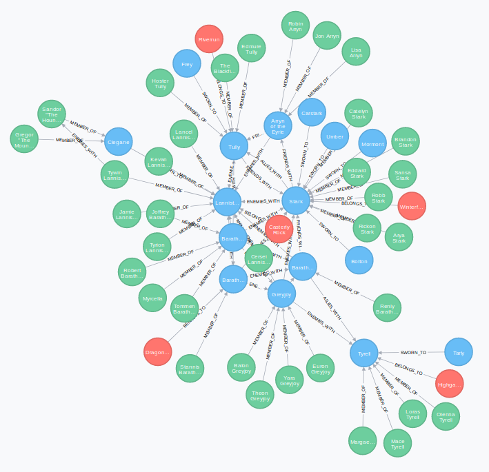

# Game of nodes

> Short introduction to using Neo4j with PHP. The example databases contains an (incomplete and partially inaccurate) set of houses, characters and castles of Westeros as well as the relationships between them at the beginning of the war of the 5 kings as known from the popular book series "A song of ice and fire" by George R. R. Martin (a.k.a. "Game of Thrones", the HBO tv series).



## Installation

Just run the `install` make target:

```
make install
```

This should spin up all containers, install the composer dependencies and populate the database with fixture data.

## Take a look at the database

Go to `http://127.0.0.1:7474/browser/` in a browser of your choice. Then log in with the credentials `neo4j` and `admin`.

After that you should see the Neo4j dashboard with a cypher console on top. Enter the following cypher query into the console and hit "(▶) Play":

```cypher
MATCH (n) OPTIONAL MATCH (n)-[r]-() RETURN n,r LIMIT 100
```


Then you should see a graphical representation of the entire database.

## Run the examples

The examples display various ways to query a Neo4J database. Each example comes with a make target, so just run one of these:

```
make example-friend-or-foe
make example-family
make example-friends
make example-enemies
make example-welcome-in
```

## Further Resources

* Neo4j Website: https://neo4j.com
* Cypher Documentation: https://neo4j.com/docs/cypher-manual/current/
* GraphAware Neo4j PHP Client: https://github.com/graphaware/neo4j-php-client
