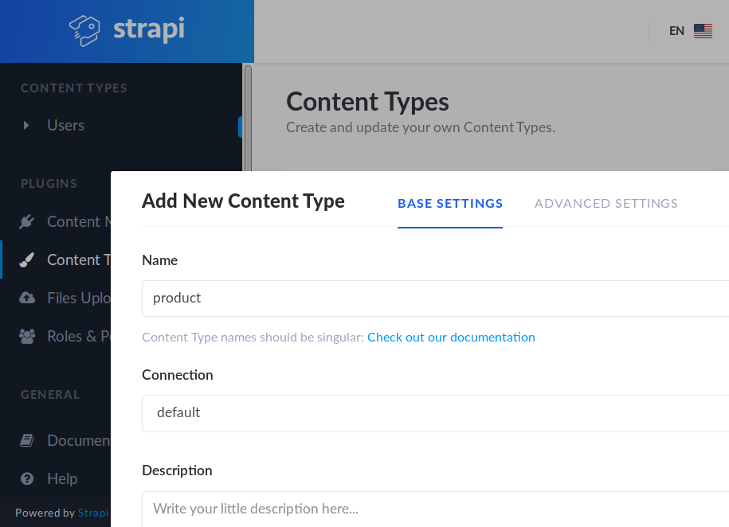

# Strapi.io

> Small example setup for a strapi.io project, using strapi version `v3.0.0-alpha`. Strapi is a headless CMS for Node.js, allowing for GUI-driven data schema design and handling editing, publishing add access restriction to data in various data types. It comes with a built-in RESTful API for content delivery, but can easily be extended with a GraphQL API as well.



## System requirements to run the example

* node >= 10
* npm >= 6
* docker >= 18.02.0
* make

## How to run the example

Install strapi cli
```
npm install strapi@alpha -g
```

Start docker und init new project

````
make init
````

When prompted for configuration options, go with the following choices:

```
? Choose your installation type: Custom (manual settings)
? Choose your main database: Postgres
? Database name: strapi
? Host: 0.0.0.0
? Port: 8086
? Username: toor
? Password: toor
? Enable SSL connection: false
```

Now two PostgreSQL container and one adminer container are running and a new strapi project is initialized.
Go to http://localhost:1337/admin to create your admin user.


### Start and stop

````
make up
````

````
make down
````


## Setup example project

If needed do a cleanup:

````
make cleanup
````

Init example project:

````
make init-example
````

Now example Apis, graphql and automatic documentation are initialized

Admin:
* http://localhost:1337/adminer

Static frontend:
* http://localhost:1337

REST:
* http://localhost:1337/products

GraphQL (Playground):
* http://localhost:1337/graphql

Documentation (Swagger):
* http://localhost:1337/documentation/v1.0.0

### Start and stop

````
make up-example
````

````
make down
````

## Further resources

* Strapi.io Website: https://strapi.io
* Strapi.io Documentation: https://strapi.io/documentation/
* Strapi.io on Github: https://github.com/strapi/strapi
* Strapi.io Official Examples: https://github.com/strapi/strapi-examples/